# Hybrid SQUID Sensor Arrays for Nuclear Plant Radiation Monitoring
### Numerical Simulation, Quantum Anomaly Detection & Publication-Figure Pipeline

[](https://github.com/OWNER/REPO/actions/workflows/ci.yml)
[](LICENSE)
[](https://www.python.org/)
[](https://jupyter.org/)
[](#citation)

> **TL;DR.** This repository is the full, reproducible numerical-simulation
> and figure-generation pipeline behind the manuscript *"Hybrid SQUID Sensor
> Arrays for Nuclear Plant Radiation Monitoring."* It implements the
> manuscript's own physics and quantum-information equations as executable
> Python, runs them to produce a ~90,000-row simulated dataset, independently
> validates that dataset against its own governing equations (8/8 checks
> pass), and turns it into 9 publication-ready multi-panel figures plus a
> full LaTeX supplementary package — all from one command.

---

## Table of contents

1. [What this project does](#what-this-project-does)
2. [Repository structure](#repository-structure)
3. [Quickstart](#quickstart)
4. [The physics, in equations](#the-physics-in-equations)
5. [Pipeline architecture](#pipeline-architecture)
6. [Headline results](#headline-results)
7. [Data dictionary](#data-dictionary)
8. [Reproducibility & validation](#reproducibility--validation)
9. [Known limitations & data-quality disclosures](#known-limitations--data-quality-disclosures)
10. [Contributing](#contributing)
11. [Citation](#citation)
12. [License](#license)

---

## What this project does

A hybrid SQUID (superconducting quantum interference device) sensor array is
proposed for real-time radiation and mechanical-anomaly monitoring inside a
nuclear power plant, combining classical flux-noise thermometry/dosimetry
with an entanglement-enhanced (GHZ) magnetometry channel and a
variational-quantum-circuit (VQC) anomaly detector. This repository answers
one question end-to-end and reproducibly:

> **Given the manuscript's own stated equations and material constants, what
> do the noise spectra, entanglement-sensing performance, anomaly-detection
> ROC curves, and predictive-maintenance trajectories actually look like when
> those equations are implemented and run — not hand-drawn?**

It is organized as four layered stages, each independently runnable:

| Stage | What it does | Where |
|---|---|---|
| **1. Simulate** | Implements the manuscript's physics/QI equations in Python and generates a ~90k-row dataset (noise spectra, QFI, anomaly scores, VQC training runs, QPMS trajectories) | [`src/squid_sim/`](src/squid_sim/) |
| **2. Validate** | Independently re-derives 8 key quantities from first principles and checks them against the generated dataset | [`notebooks/modules/module_02_validation_suite.py`](notebooks/modules/module_02_validation_suite.py) |
| **3. Visualize** | Turns the validated dataset into 9 journal-grade, multi-panel figures (55+ subplots) as a single Jupyter notebook | [`notebooks/`](notebooks/) |
| **4. Publish** | Renders every figure caption, working explanation, and all 9 supplementary tables as compiled LaTeX, ready to paste into the manuscript | [`latex/`](latex/) |

---

## Repository structure

```text
.
├── README.md                          <- you are here
├── LICENSE                            MIT
├── CITATION.cff                       machine-readable citation metadata
├── CONTRIBUTING.md
├── environment.yml                    conda/mamba environment (recommended)
├── requirements.txt                   pip fallback
├── pyproject.toml                     package metadata (src/squid_sim)
├── .gitignore
├── .github/
│   └── workflows/
│       ├── ci.yml                     lint + validation-suite + notebook execution on every push
│       └── build-figures.yml          manually-triggered full figure/PDF rebuild
│
├── src/squid_sim/                     <- STAGE 1: the simulation package
│   ├── physics.py                         SQUID noise, damage kinetics, GHZ QFI (Eqs. 1-8)
│   ├── spectra.py                         healthy + 5 failure-mode spectrum generator
│   ├── detector.py                        quantum relative-entropy + classical OC-SVM detectors
│   ├── circuit.py                         batched statevector sim + parameter-shift VQC training
│   └── run_all.py                         master script: runs everything, writes data/*.csv
│
├── data/                               <- STAGE 1 output: 12 CSVs, ~90,000 rows (see Data dictionary)
│
├── notebooks/                          <- STAGE 2 + 3
│   ├── SQUID_Manuscript_Figures.ipynb      the executable notebook (Restart & Run All)
│   ├── build_notebook.py                   regenerates the .ipynb from modules/
│   └── modules/                            ~3,000-line figure-generation codebase
│       ├── module_00_style_library.py          journal styling, colour palettes, helpers
│       ├── module_01_data_loader.py             CSV loading + validation + numeric reporting
│       ├── module_02_validation_suite.py        8 independent accuracy checks
│       ├── module_fig01 ... module_fig09.py     one file per figure (see below)
│       └── module_10_numeric_tables_report.py   formatted supplementary-table PDF generator
│
├── figures/                            <- STAGE 3 output: 9 figures + combined booklet, PDF+PNG
│
├── latex/                              <- STAGE 4 output
│   ├── supplementary_figures_and_tables.tex    compilable LaTeX source (captions + Eqs. + Tables S1-S9)
│   ├── supplementary_figures_and_tables.pdf    compiled 18-page PDF
│   └── figures/                                figure PDFs referenced by the .tex
│
├── manuscript/
│   └── main.tex                        the original manuscript LaTeX (context for equation numbers)
│
├── docs/
│   ├── METHODOLOGY.md                  full derivation of every equation + calibration choice
│   └── DATA_DICTIONARY.md              column-by-column description of every CSV
│
└── tests/
    └── test_validation_suite.py        pytest wrapper around the validation suite (used by CI)
```

---

## Quickstart

```bash
git clone https://github.com/OWNER/REPO.git
cd REPO

# Option A: conda/mamba (recommended -- pulls exact scientific-stack versions)
mamba env create -f environment.yml
conda activate squid-sim

# Option B: plain pip
python3 -m venv .venv && source .venv/bin/activate
pip install -r requirements.txt
```

**Regenerate the simulated dataset from scratch** (~5-10 minutes):

```bash
python src/squid_sim/run_all.py            # writes data/*.csv
```

**Regenerate every figure + validate the dataset** (~2-3 minutes):

```bash
cd notebooks
jupyter nbconvert --to notebook --execute --inplace SQUID_Manuscript_Figures.ipynb
```

**Just want the results without running anything?** Everything is already
generated and committed: open `figures/*.pdf` directly, or
`notebooks/SQUID_Manuscript_Figures.ipynb` in Jupyter to browse without
re-running.

**Run only the accuracy checks:**

```bash
pytest tests/ -v
```

---

## The physics, in equations

Every number in `data/*.csv` traces back to one of these equations
(full derivations in [`docs/METHODOLOGY.md`](docs/METHODOLOGY.md)):

**SQUID flux-noise spectrum** (Tesche–Clarke thermal term + TLS 1/f term):

$$
S_\Phi^{\mathrm{tot}}(f,t) = S_\Phi^{\mathrm{zpf}}(f) + \frac{16\,k_B T\,L_{\mathrm{sq}}^2/R_n}{1+\left(2\pi f L_{\mathrm{sq}}/R_n\right)^2} + \frac{A_\varphi(t)}{f}
$$

**Radiation-damage-driven noise growth** (calibrated $\sqrt{1+\kappa\,\mathcal{D}(t)}$ law):

$$
A_\varphi(t) = A_\varphi^{(0)}\sqrt{1+\kappa_{\mathrm{eff}}\,\mathcal{D}(t)/\mathcal{D}(T_{\mathrm{ref}})}, \qquad \mathcal{D}(t)=\xi\,\Phi_n\,\sigma_{\mathrm{dpa}}\,t
$$

**Exact GHZ quantum Fisher information under independent dephasing:**

$$
\mathcal{F}_Q(N,\tau) = N^2\, e^{-2N\,\Gamma_{\mathrm{deph}}(t)\,\tau}, \qquad \mathcal{V}(\tau) = e^{-N\Gamma_{\mathrm{deph}}(t)\tau} = \sqrt{\mathcal{F}_Q}/N
$$

**Quantum anomaly score (Umegaki relative entropy to the healthy manifold):**

$$
\rho_{\mathrm{healthy}} = \frac{1}{M}\sum_{i=1}^{M}\ket{\psi_i}\!\bra{\psi_i} = \sum_k \lambda_k \ket{v_k}\!\bra{v_k}, \qquad
\mathcal{A}(t) = -\sum_k \ln(\lambda_k)\,\big|\langle v_k|\psi_t\rangle\big|^2
$$

**VQC parameter-shift training rule** (exact gradient, no finite-difference approximation):

$$
\frac{\partial \mathcal{L}}{\partial \theta_k} = \tfrac{1}{2}\Big[\mathcal{L}\big(\theta_k+\tfrac{\pi}{2}\big) - \mathcal{L}\big(\theta_k-\tfrac{\pi}{2}\big)\Big]
$$

---

## Pipeline architecture

```mermaid
flowchart LR
    A["Manuscript equations<br/>(main.tex)"] --> B["src/squid_sim/physics.py<br/>spectra.py"]
    B --> C["src/squid_sim/detector.py<br/>circuit.py"]
    C --> D["run_all.py<br/>writes data/*.csv<br/>(~90,000 rows, 12 tables)"]
    D --> E["module_01_data_loader.py<br/>load + validate"]
    E --> F["module_02_validation_suite.py<br/>8/8 first-principles checks"]
    F --> G["module_fig01..09.py<br/>9 multi-panel figures"]
    G --> H["figures/*.pdf<br/>ALL_FIGURES_COMBINED.pdf"]
    F --> I["module_10_numeric_tables_report.py<br/>Supplementary_Numeric_Tables.pdf"]
    H --> J["latex/supplementary_figures_and_tables.tex<br/>captions + equations + Tables S1-S9"]
    I --> J
    J --> K["compiled 18-page PDF<br/>ready for manuscript submission"]
```



---

## Headline results

| Quantity | Value | Source |
|---|---|---|
| Overall quantum-detector AUC | **0.9486** | `data/05_roc_curve_overall.csv` |
| Overall classical-detector (OC-SVM) AUC | **0.9500** | same |
| Best VQC hyperparameter-sweep AUC | **0.9543** (L=2, n=8, η=0.01) | `data/10_vqc_hyperparameter_sweep.csv` |
| Hardest failure mode (both detectors) | **Coolant flow anomaly** (AUC ≈ 0.75) | `data/06_anomaly_performance_by_mode.csv` |
| QFI retained at 10 yr, N=64 | **24.5%** of fresh value (4031 → 988) | `data/02_sensor_lifecycle_trace.csv` |
| Entanglement visibility at 10 yr | **0.491** (from 0.992 fresh) | same |
| $I_c$ retained at 10 yr | **90.0%** | same |
| QPMS critical-threshold crossing | **t = 3.07 yr** | `data/08_qpms_trajectory.csv` |
| Mean early-warning horizon (quantum) | **23.0 h** before hard alarm | `data/07_early_warning_horizon.csv` |
| Validation-suite result | **8 / 8 checks passed** | `tests/test_validation_suite.py` |

---

## Data dictionary

See [`docs/DATA_DICTIONARY.md`](docs/DATA_DICTIONARY.md) for the full,
column-by-column description of all 12 tables in `data/`. Short version:

| File | Rows | Contents |
|---|---:|---|
| `00_squid_simulation_parameters.csv` | 13 | Input constants (manuscript Table 3) |
| `00_material_damage_parameters.csv` | 8 | Nb material constants (manuscript Table B.1) |
| `01_squid_noise_spectra.csv` | 20,480 | Flux-noise spectra, 4 lifecycle stages × 20 reps × 256 freq bins |
| `02_sensor_lifecycle_trace.csv` | 200 | Continuous 0–10 yr trace: DDD, Ic, A_φ, f_c, Γ_deph, QFI, visibility |
| `03_qfi_vs_N_and_dose.csv` | 63 | QFI/visibility vs. array size N and dose |
| `04_anomaly_scores_full_testset.csv` | 22,500 | Per-sample quantum + classical anomaly scores, labelled |
| `05_roc_curve_overall.csv` | 45,004 | Full ROC curves, both detectors |
| `06_anomaly_performance_by_mode.csv` | 5 | TPR/AUC/FPR per failure mode |
| `07_early_warning_horizon.csv` | 5 | Simulated early-warning hours per failure mode |
| `08_qpms_trajectory.csv` | 400 | 5-year QPMS composite trajectory |
| `09_early_detection_probability_vs_N.csv` | 75 | Detection-probability curves, N=4/16/64 |
| `10_vqc_hyperparameter_sweep.csv` | 8 | Real parameter-shift-trained VQC results |

---

## Reproducibility & validation

Every quantity that appears in a figure or table is checked, not assumed:

- **`module_02_validation_suite.py`** independently re-derives the QFI
  closed form, the visibility identity $\mathcal{V}=\sqrt{\mathcal{F}_Q}/N$,
  ROC monotonicity, AUC bounds, the corner-frequency identity, and every
  probability/fraction column's valid range — **8/8 currently pass**, and
  this suite runs automatically in CI on every push (see
  `.github/workflows/ci.yml`).
- Every figure module prints the exact numeric table it plots *before*
  drawing anything (`sl.print_numeric_summary`), so console output and PDF
  output can be cross-checked line by line.
- Random seeds are fixed everywhere (`MASTER_SEED = 20260921`), so
  `run_all.py` reproduces `data/*.csv` bit-for-bit on any machine with the
  pinned `environment.yml`.

---

## Known limitations & data-quality disclosures

In the interest of scientific integrity, three internal inconsistencies were
found in the manuscript's own equations while implementing this simulation,
and were **transparently documented and calibrated rather than silently
"fixed"** — full derivations in `docs/METHODOLOGY.md`:

1. `eq:ddd`'s literal displacement-damage formula divides by atomic number
   density, breaking its dpa units; the standard NRT dpa-rate definition is
   used instead.
2. The manuscript's stated $\kappa_{\mathrm{TLS}}$ and $\alpha_\varphi$
   coefficients, used literally, are dimensionally inconsistent /
   physically implausible (predicting near-instant decoherence). Two
   calibration constants ($\kappa_{\mathrm{eff}}$, $\alpha_{\mathrm{eff}}$)
   are used instead, calibrated against the manuscript's *own* stated
   operating milestones.
3. Naive per-sample-normalized amplitude encoding was found to be
   mathematically blind to any failure mode that manifests as a uniform
   magnitude change rather than a shape change (verified: AUC dropped to
   0.60). A magnitude-preserving ancilla encoding is used instead (restores
   AUC to 0.95), documented in `src/squid_sim/detector.py`.

Additionally, several parameters were run at reduced scale relative to the
manuscript's stated values for CI/local runtime budget (documented inline
wherever they occur): VQC training used 3 seeds × 60 iterations instead of
10 seeds; the healthy training set for VQC used 200 spectra instead of
10,000. All scripts are fully parameterized so a full-scale run is a
one-line change (`N_TRAIN`, `SEEDS`, `N_ITERS` in `run_all.py`).

---

## Contributing

See [`CONTRIBUTING.md`](CONTRIBUTING.md). In short: fork, branch, make sure
`pytest tests/` passes and the notebook still executes end-to-end with zero
errors, then open a PR.

## Citation

See [`CITATION.cff`](CITATION.cff). This repository accompanies the
manuscript; please cite the manuscript for the physical model and this
repository (via its DOI, once archived — e.g. through Zenodo) for the
simulation/figure code itself.

## License

Released under the [MIT License](LICENSE). The manuscript text in
`manuscript/` remains the copyright of its authors and is included here only
for equation-number cross-referencing.
